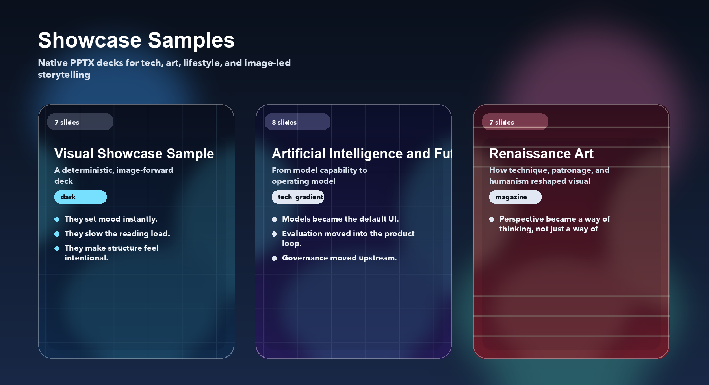

# AutoPPT

[中文说明](README.zh-CN.md)


[](https://github.com/yeasy/autoppt/actions/workflows/workflow.yml)

Generate polished, editable PowerPoint decks from a topic, an outline, or a template.

AutoPPT is a PowerPoint-native presentation generator built for people who need real `.pptx` files, not a web-only slide toy. It combines LLM planning, optional research, layout-aware rendering, and template support so the output stays editable in PowerPoint, Keynote, or Google Slides.

## Why AutoPPT

- Native `.pptx` output that stays editable after generation
- Template-aware rendering for branded decks and repeatable formatting
- Layout planning before rendering, including richer slide types such as comparison and quote slides
- Slide-level workbench for regenerate and remix workflows
- Mock mode and offline mode for CI, demos, and local development without live API keys

## See It In Action

### Showcase Samples

These committed decks are the fastest way to judge current output quality.

[](samples/en_visual_showcase.pptx)

| Sample | Focus | Slides |
| --- | --- | ---: |
| [samples/en_visual_showcase.pptx](samples/en_visual_showcase.pptx) | High-fidelity image-led showcase | 8 |
| [samples/cn_visual_showcase.pptx](samples/cn_visual_showcase.pptx) | High-fidelity image-led showcase in Chinese | 8 |
| [samples/en_tech.pptx](samples/en_tech.pptx) | English technology deck | 9 |
| [samples/cn_tech.pptx](samples/cn_tech.pptx) | Chinese technology deck | 9 |
| [samples/en_life.pptx](samples/en_life.pptx) | English lifestyle deck | 8 |
| [samples/cn_life.pptx](samples/cn_life.pptx) | Chinese lifestyle deck | 8 |
| [samples/en_art.pptx](samples/en_art.pptx) | English art deck | 8 |
| [samples/cn_art.pptx](samples/cn_art.pptx) | Chinese art deck | 8 |

Feature-oriented validation decks are documented in [samples/README.md](samples/README.md).

## 30-Second Quick Try

Install AutoPPT and generate a local deck without any external API key:

```bash
pip install autoppt
AUTOPPT_OFFLINE=1 autoppt --provider mock --topic "The Future of AI"
```

Run the web UI:

```bash
streamlit run autoppt/app.py
```

## Core Capabilities

| Capability | What it gives you |
| --- | --- |
| Multi-provider generation | OpenAI, Google Gemini, Anthropic, or `mock` for local testing |
| Research pipeline | Optional web search, article extraction, and image discovery |
| Theme system | Multiple built-in themes plus auto-style selection |
| Template support | Reuse existing corporate `.pptx` templates |
| Slide planning | `SlidePlan`, `SlideSpec`, and `DeckSpec` provide a stable intermediate model |
| Deck QA | Detect duplicate titles, empty slides, and malformed richer layouts before export |
| Workbench | Regenerate or remix a single slide with an optional target layout |
| Thumbnail previews | Render slide grids for quick visual review |
| Docker support | Run the web app in Docker or Docker Compose |

## Installation

Install from PyPI:

```bash
pip install autoppt
```

Install from source:

```bash
git clone https://github.com/yeasy/autoppt.git
cd autoppt
pip install -e .
```

Install development dependencies:

```bash
pip install -e ".[dev]"
```

The dependency source of truth is [`pyproject.toml`](pyproject.toml). `requirements.txt` is kept as a thin local install wrapper.

## Configuration

Copy the example environment file and add the providers you want to use:

```bash
cp .env.example .env
```

Typical variables:

```bash
OPENAI_API_KEY=sk-...
GOOGLE_API_KEY=AIza...
ANTHROPIC_API_KEY=sk-ant-...

# Optional local OpenAI-compatible endpoint
OPENAI_API_BASE=http://localhost:1234/v1

# Optional offline mode
AUTOPPT_OFFLINE=1
```

## Usage

### CLI

```bash
# Generate with default settings
autoppt --topic "The Future of AI"

# Let AutoPPT infer the best theme
autoppt --topic "Machine Learning Tutorial" --auto-style

# Preview the outline before rendering
autoppt --topic "Startup Pitch" --confirm-outline

# Generate outline only
autoppt --topic "Q1 Report" --outline-only

# Use a specific provider and style
autoppt --topic "Planets in Solar System" --provider google --style dark

# Use a custom template and render thumbnails
autoppt --topic "Q3 Report" --template templates/your-template.pptx --thumbnails

# Stay fully local for testing and CI
AUTOPPT_OFFLINE=1 autoppt --provider mock --topic "System Design Review"
```

### Web App

```bash
streamlit run autoppt/app.py
```

Then open `http://localhost:8501`.

### Docker

Run with Docker Compose:

```bash
docker-compose up -d
docker-compose logs -f
```

Run with Docker CLI:

```bash
docker build -t autoppt .
docker run --rm \
  -p 8501:8501 \
  --env-file .env \
  -v $(pwd)/output:/app/output \
  autoppt
```

## Themes

Built-in themes:

`minimalist`, `technology`, `nature`, `creative`, `corporate`, `academic`, `startup`, `dark`, `luxury`, `magazine`, `tech_gradient`, `ocean`, `sunset`, `chalkboard`, `blueprint`, `sketch`, `retro`, `neon`

Use `--style <theme>` to force a specific look, or `--auto-style` to let AutoPPT choose.

## Samples

Refresh all committed samples deterministically:

```bash
python scripts/generate_samples.py --category all --output-dir samples
```

Refresh one sample:

```bash
python scripts/generate_sample.py en_visual_showcase --output-dir samples
```

Refresh README preview assets:

```bash
python scripts/generate_readme_previews.py --output-dir docs/assets
```

For the full sample catalog, see [samples/README.md](samples/README.md).

## Testing

Run the full test suite:

```bash
pip install -e ".[dev]"
pytest
```

Run coverage:

```bash
pytest --cov=autoppt --cov-report=term-missing
```

Run a focused test file:

```bash
pytest tests/test_renderer.py -v
```

## Templates

Template guidance lives in [templates/README.md](templates/README.md).

## Architecture

Architecture notes live in [docs/architecture.md](docs/architecture.md).

## Contributing

1. Fork the repository.
2. Create a branch: `git checkout -b feature/awesome`
3. Install dev dependencies: `pip install -e ".[dev]"`
4. Run validation: `pytest && python3 scripts/check_sensitive.py`
5. Build and smoke test: `python -m build && pip install dist/*.whl && autoppt --help`
6. Commit your changes.
7. Push your branch and open a pull request.

## License

Apache 2.0. See [LICENSE](LICENSE).

## Changelog

See [CHANGELOG.md](CHANGELOG.md).
