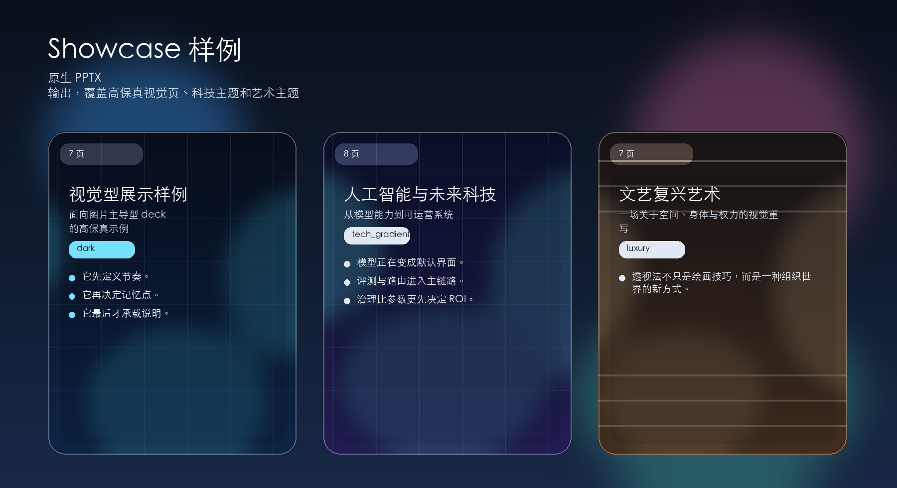

# AutoPPT

[English README](README.md)


[](https://github.com/yeasy/autoppt/actions/workflows/workflow.yml)

根据主题、大纲或模板生成美观且可继续编辑的 PowerPoint 演示文稿。

AutoPPT 是一个面向原生 PowerPoint 的演示文稿生成器，目标不是做一个只能在线查看的幻灯片玩具，而是稳定产出真实可编辑的 `.pptx` 文件。它把大模型规划、可选研究、版式选择和模板渲染组合起来，让生成结果依然可以在 PowerPoint、Keynote 或 Google Slides 中继续修改。

## 为什么选择 AutoPPT

- 直接输出原生 `.pptx`，生成后仍可编辑
- 支持企业模板与品牌样式，适合稳定复用
- 先规划版式再渲染，支持 comparison、quote 等 richer layouts
- 提供单页工作台，可对某一页做 regenerate 或 remix
- 提供 mock 模式和离线模式，便于 CI、演示和本地开发

## 先看效果

### Showcase 样例

下面这些样例文件已经提交到仓库，是判断当前输出质量最快的入口。

[](samples/cn_visual_showcase.pptx)

| 样例 | 说明 | 页数 |
| --- | --- | ---: |
| [samples/en_visual_showcase.pptx](samples/en_visual_showcase.pptx) | 英文高保真图片型 showcase | 8 |
| [samples/cn_visual_showcase.pptx](samples/cn_visual_showcase.pptx) | 中文高保真图片型 showcase | 8 |
| [samples/en_tech.pptx](samples/en_tech.pptx) | 英文科技主题 | 9 |
| [samples/cn_tech.pptx](samples/cn_tech.pptx) | 中文科技主题 | 9 |
| [samples/en_life.pptx](samples/en_life.pptx) | 英文生活方式主题 | 8 |
| [samples/cn_life.pptx](samples/cn_life.pptx) | 中文生活方式主题 | 8 |
| [samples/en_art.pptx](samples/en_art.pptx) | 英文艺术主题 | 8 |
| [samples/cn_art.pptx](samples/cn_art.pptx) | 中文艺术主题 | 8 |

偏功能验证的样例单独整理在 [samples/README.zh-CN.md](samples/README.zh-CN.md)。

## 30 秒快速体验

安装 AutoPPT，并在不依赖任何外部 API Key 的情况下生成一份本地样例 deck：

```bash
pip install autoppt
AUTOPPT_OFFLINE=1 autoppt --provider mock --topic "The Future of AI"
```

运行 Web 界面：

```bash
streamlit run autoppt/app.py
```

## 核心能力

| 能力 | 作用 |
| --- | --- |
| 多模型后端 | 支持 OpenAI、Google Gemini、Anthropic，也支持本地 `mock` 测试 |
| 研究流水线 | 可选网页搜索、文章抓取与图片发现 |
| 主题系统 | 内置多套主题，并支持自动风格选择 |
| 模板支持 | 可复用现有企业 `.pptx` 模板 |
| 幻灯片规划层 | 通过 `SlidePlan`、`SlideSpec`、`DeckSpec` 建立稳定中间模型 |
| Deck QA | 在导出前检查重复标题、空白页和异常 richer layouts |
| Workbench | 支持单页 regenerate 或 remix，并可指定目标版式 |
| 缩略图预览 | 可生成缩略图网格进行快速审阅 |
| Docker 支持 | 可通过 Docker 或 Docker Compose 运行 |

## 安装

从 PyPI 安装：

```bash
pip install autoppt
```

从源码安装：

```bash
git clone https://github.com/yeasy/autoppt.git
cd autoppt
pip install -e .
```

安装开发依赖：

```bash
pip install -e ".[dev]"
```

依赖定义以 [`pyproject.toml`](pyproject.toml) 为准，`requirements.txt` 仅作为本地安装薄包装。

## 配置

复制环境变量示例文件，并按需填写你要使用的模型服务商配置：

```bash
cp .env.example .env
```

常见变量如下：

```bash
OPENAI_API_KEY=sk-...
GOOGLE_API_KEY=AIza...
ANTHROPIC_API_KEY=sk-ant-...

# 可选：本地兼容 OpenAI 的服务端点
OPENAI_API_BASE=http://localhost:1234/v1

# 可选：离线模式
AUTOPPT_OFFLINE=1
```

## 使用方式

### 命令行

```bash
# 使用默认参数生成
autoppt --topic "The Future of AI"

# 自动选择更合适的主题风格
autoppt --topic "Machine Learning Tutorial" --auto-style

# 生成前先确认大纲
autoppt --topic "Startup Pitch" --confirm-outline

# 仅生成大纲，不导出 PPT
autoppt --topic "Q1 Report" --outline-only

# 指定模型服务商和主题
autoppt --topic "Planets in Solar System" --provider google --style dark

# 使用模板并输出缩略图
autoppt --topic "Q3 Report" --template templates/your-template.pptx --thumbnails

# 在本地和 CI 中完全离线运行
AUTOPPT_OFFLINE=1 autoppt --provider mock --topic "System Design Review"
```

### Web 应用

```bash
streamlit run autoppt/app.py
```

然后打开 `http://localhost:8501`。

### Docker

使用 Docker Compose：

```bash
docker-compose up -d
docker-compose logs -f
```

使用 Docker CLI：

```bash
docker build -t autoppt .
docker run --rm \
  -p 8501:8501 \
  --env-file .env \
  -v $(pwd)/output:/app/output \
  autoppt
```

## 主题

内置主题包括：

`minimalist`, `technology`, `nature`, `creative`, `corporate`, `academic`, `startup`, `dark`, `luxury`, `magazine`, `tech_gradient`, `ocean`, `sunset`, `chalkboard`, `blueprint`, `sketch`, `retro`, `neon`

使用 `--style <theme>` 强制指定主题，或使用 `--auto-style` 自动选择。

## 样例

确定性刷新全部样例：

```bash
python scripts/generate_samples.py --category all --output-dir samples
```

单独刷新某一个样例：

```bash
python scripts/generate_sample.py en_visual_showcase --output-dir samples
```

刷新 README 里的预览图：

```bash
python scripts/generate_readme_previews.py --output-dir docs/assets
```

完整样例目录见 [samples/README.zh-CN.md](samples/README.zh-CN.md)。

## 测试

运行全部测试：

```bash
pip install -e ".[dev]"
pytest
```

生成覆盖率报告：

```bash
pytest --cov=autoppt --cov-report=term-missing
```

运行某个测试文件：

```bash
pytest tests/test_renderer.py -v
```

## 模板

模板说明见 [templates/README.zh-CN.md](templates/README.zh-CN.md)。

## 架构

架构说明见 [docs/architecture.zh-CN.md](docs/architecture.zh-CN.md)。

## 参与贡献

1. Fork 本仓库
2. 创建分支：`git checkout -b feature/awesome`
3. 安装开发依赖：`pip install -e ".[dev]"`
4. 运行验证：`pytest && python3 scripts/check_sensitive.py`
5. 打包并做 smoke test：`python -m build && pip install dist/*.whl && autoppt --help`
6. 提交代码
7. 推送分支并发起 Pull Request

## 许可证

Apache 2.0。详见 [LICENSE](LICENSE)。

## 更新日志

见 [CHANGELOG.md](CHANGELOG.md)。
