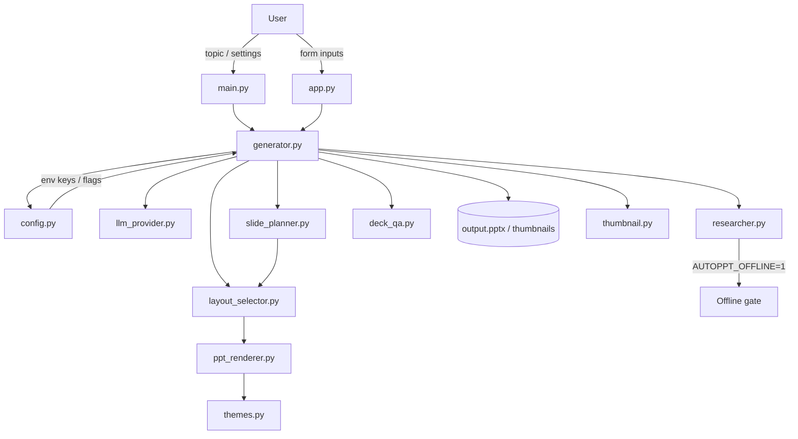

# AutoPPT Architecture

[中文说明](architecture.zh-CN.md)

This document captures the current target architecture after the recent refactors.

## Current Target Architecture

AutoPPT is split into six functional layers.

- Input Layer: `main.py` and `app.py` collect topic, language, style, provider, and output options.
- Orchestration Layer: `generator.py` owns run flow, coordinates outline generation, slide planning, slide content generation, remix, and final rendering.
- Service Layer: `llm_provider.py` and `researcher.py` provide pluggable content synthesis and evidence acquisition.
- Planning Layer: `slide_planner.py` converts outline topics and remix intent into layout-aware `SlidePlan` objects.
- Presentation Contract Layer: `data_types.py` defines typed boundaries across layers, including `SlidePlan`, `DeckSpec`, `SlideSpec`, and `SlideConfig`.
- Rendering Layer: `layout_selector.py` chooses renderer-facing layouts, `ppt_renderer.py` handles PPTX drawing, and `themes.py` owns theme tokens.

## Module Boundaries

- `config.py` owns runtime configuration and feature toggles.
- `llm_provider.py` owns provider selection, prompt contracts, and LLM responses.
- `researcher.py` owns online research, image search and download, and optional offline short-circuit behavior.
- `slide_planner.py` owns layout intent, remix heuristics, and fallback normalization for richer layouts.
- `generator.py` owns pipeline decisions, deck assembly, slide remix, and exception fallback for generation flow.
- `layout_selector.py` maps `SlideConfig` into renderer-facing `SlideSpec` layout choices.
- `ppt_renderer.py` owns concrete slide drawing, spacing, image treatment, and file persistence.
- `themes.py` is the single source of truth for theme definitions and presentation tokens.
- `style_selector.py` maps topic intent to a concrete theme name.
- `template_handler.py` contains template upload and inspection logic for template-aware rendering.
- `data_types.py` defines typed boundaries across layers, including `SlidePlan`, `DeckSpec`, `SlideSpec`, and `SlideConfig`.
- `exceptions.py` defines the exception hierarchy (`AutoPPTError`, `APIKeyError`, `RateLimitError`, `RenderError`).
- `deck_qa.py` provides post-generation quality checks such as duplicate title detection and empty slide detection.
- `thumbnail.py` renders slide thumbnail grids for quick visual review.
- `sample_library.py` provides `build_sample_deck()` for generating sample and showcase decks.
- `app.py` and `main.py` stay thin orchestration layers and should not own generation policy.

## Data Flow

1. UI or CLI validates inputs and builds generation options.
2. `generator.py` creates an outline (`PresentationOutline`) from the LLM.
3. For each slide topic, the generator creates a `SlidePlan`.
4. The generator enriches the plan with research signals and asks the LLM for a `SlideConfig`.
5. `slide_planner.py` and `layout_selector.py` normalize the result into `DeckSpec` and `SlideSpec`.
6. `ppt_renderer.py` converts normalized slide specs into concrete slides and writes the PPTX.
7. Optional post-processing generates thumbnails and citations slides.

## Design Decisions Captured By Recent Refactors

- Theme definitions moved to `themes.py` to separate style assets from rendering mechanics.
- Provider behavior now supports an offline mode signal through `Config`, so `Researcher` can skip network calls and still allow deterministic test and CI runs.
- `SlidePlan` adds an explicit planning seam between outline topics and generated slide content.
- `DeckSpec` and `SlideSpec` now provide a stable intermediate representation between generation and rendering.
- `layout_selector.py` owns first-pass layout dispatch instead of embedding that policy inside `generator.py`.
- The Web UI stores the latest `DeckSpec` in session state and supports slide-level remix without regenerating the full outline.
- Minimum end-to-end verification includes real PPTX smoke validation with `mock` provider output.
- README previews now support a real-thumbnail rendering path when thumbnail dependencies are available, with a deterministic fallback when they are not.

## Near-Term Roadmap

- Milestone 1: evolve `SlidePlan` from pure heuristics to a hybrid planner that can optionally use a smaller model when APIs are available.
- Milestone 2: add template-aware placeholder mapping so `SlidePlan` and `SlideSpec` can target brand-constrained deck outputs.
- Milestone 3: add lightweight job metadata and deck history so remix, retries, and exports survive across web sessions.
