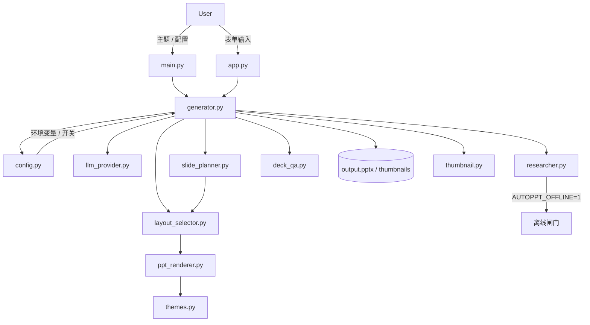

# AutoPPT 架构说明

[English README](architecture.md)

本文档说明最近一轮重构之后的目标架构。

## 当前目标架构

AutoPPT 当前可以分成六个功能层。

- 输入层：`main.py` 和 `app.py` 负责收集主题、语言、风格、模型供应商和输出参数。
- 编排层：`generator.py` 负责主执行流，协调大纲生成、幻灯片规划、内容生成、remix 与最终渲染。
- 服务层：`llm_provider.py` 与 `researcher.py` 提供可插拔的内容生成与证据获取能力。
- 规划层：`slide_planner.py` 将大纲主题和 remix 指令转换为带布局意图的 `SlidePlan`。
- 演示契约层：`data_types.py` 定义跨层数据边界，核心结构包括 `SlidePlan`、`DeckSpec`、`SlideSpec` 与 `SlideConfig`。
- 渲染层：`layout_selector.py` 负责选择面向渲染器的布局类型，`ppt_renderer.py` 负责 PPTX 绘制，`themes.py` 负责主题令牌。

## 模块边界

- `config.py` 负责运行时配置与功能开关。
- `llm_provider.py` 负责模型供应商选择、提示词约定与 LLM 响应。
- `researcher.py` 负责在线研究、图片搜索与下载，以及离线短路行为。
- `slide_planner.py` 负责 richer layout 的布局意图、remix 启发式与兜底规范化。
- `generator.py` 负责执行策略、Deck 装配、单页 remix 和异常回退。
- `layout_selector.py` 将 `SlideConfig` 映射为面向渲染器的 `SlideSpec` 布局选择。
- `ppt_renderer.py` 负责实际幻灯片绘制、留白、图片处理和文件持久化。
- `themes.py` 是主题定义和设计令牌的唯一可信源。
- `style_selector.py` 将主题意图映射为具体主题名。
- `template_handler.py` 存放模板上传与检查逻辑，为模板感知渲染做准备。
- `data_types.py` 定义跨层的类型化边界，包括 `SlidePlan`、`DeckSpec`、`SlideSpec` 和 `SlideConfig`。
- `exceptions.py` 定义异常层级（`AutoPPTError`、`APIKeyError`、`RateLimitError`、`RenderError`）。
- `deck_qa.py` 提供生成后质量检查，如重复标题检测和空幻灯片检测。
- `thumbnail.py` 渲染幻灯片缩略图网格，便于快速可视化预览。
- `sample_library.py` 提供 `build_sample_deck()` 用于生成示例和展示 Deck。
- `app.py` 与 `main.py` 保持轻量编排，不应承载生成策略。

## 数据流

1. UI 或 CLI 校验输入，并构建生成参数。
2. `generator.py` 从 LLM 生成大纲 `PresentationOutline`。
3. 对每个幻灯片主题，生成器先创建 `SlidePlan`。
4. 生成器为计划注入研究证据，再让 LLM 输出 `SlideConfig`。
5. `slide_planner.py` 与 `layout_selector.py` 将结果规范化为 `DeckSpec` 和 `SlideSpec`。
6. `ppt_renderer.py` 将标准化结构转换为实际幻灯片并写入 PPTX。
7. 可选后处理步骤会生成缩略图和引用页。

## 最近重构中固化下来的设计决策

- 主题定义迁移到 `themes.py`，实现样式资产与渲染实现解耦。
- `Config` 的离线信号使 `Researcher` 可以跳过网络请求，保证测试与 CI 的确定性。
- `SlidePlan` 在大纲主题与最终生成内容之间建立了显式规划层。
- `DeckSpec` 与 `SlideSpec` 形成生成与渲染之间稳定的中间层。
- `layout_selector.py` 承担首轮布局分发职责，避免在 `generator.py` 中硬编码布局策略。
- Web UI 现在会在 session state 中保存最新 `DeckSpec`，支持单页 remix，无需重跑整份 outline。
- 最小端到端验证包含基于 `mock` provider 的真实 PPTX 冒烟测试。
- README 预览图现在支持真实缩略图链路；当本地缺少缩略图依赖时，会自动退回到确定性的卡片预览。

## 近期路线图

- 里程碑 1：将 `SlidePlan` 从纯启发式升级为可选接入小模型的混合规划器。
- 里程碑 2：增加模板占位感知映射，使 `SlidePlan` 与 `SlideSpec` 可面向企业品牌模板输出。
- 里程碑 3：增加轻量任务元数据与 deck 历史，让 remix、重试和导出跨 Web 会话保留。
